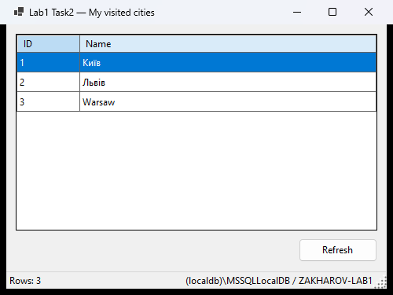

# Task2 — LocalDB database shown in a DataGridView

Database `ZAKHAROV-LAB1` in SQL Server LocalDB with its files in `C:\LAB-1\Task-6`, table `MyVisitedCities`
(`ID int`, `Name nvarchar(max)`) with three rows — two of them in Cyrillic — and a Windows Forms program that shows the
table in a `DataGridView`.



## 1. Create the database in SSMS

1. Open SSMS and connect to **`(localdb)\MSSQLLocalDB`**, Windows Authentication, Encryption *Mandatory* with
   **Trust server certificate** checked (LocalDB uses a self-signed certificate).
2. Open and run [`sql/01-create-database.sql`](sql/01-create-database.sql) — creates `C:\LAB-1\Task-6` and the database
   with `ZAKHAROV-LAB1.mdf` / `ZAKHAROV-LAB1_log.ldf` there.
3. In Object Explorer refresh **Databases**, right-click **ZAKHAROV-LAB1 → New Query**, open and run
   [`sql/02-schema-and-data.sql`](sql/02-schema-and-data.sql) — creates the table and the rows.

Both scripts are safe to run again. Note the `N'...'` prefix on the string literals: without it the Cyrillic names
would be stored as `?` under a non-Cyrillic collation.

## 2. Run the program

Start `Task2.CitiesViewer` (F5 in Visual Studio). It connects to
`(localdb)\MSSQLLocalDB / ZAKHAROV-LAB1`; another database can be given as the first command-line argument or in the
`LAB1_TASK2_CONNECTION` environment variable (full connection string).

If the database or the table is missing, the program says which script to run instead of showing a raw SQL error.

## Design notes

- `CitiesRepository` reads the rows with `Microsoft.Data.SqlClient` (async, `ORDER BY ID`, `NULL` names kept as `null`)
  and the form binds them through a `BindingSource` with explicitly defined columns.
- Connection string: `TrustServerCertificate=true` for the self-signed LocalDB certificate, `Connect Timeout=30`
  because the first connection may start the LocalDB instance, `ConnectRetryCount=0` because SqlClient otherwise treats
  error 4060 (no such database) as transient and waits 10 s before failing.

## Tests

```
dotnet test ../Lab1.slnx
```

The database tests create a temporary database in LocalDB, run the same `02-schema-and-data.sql` that is used in SSMS
on it, check the rows (including the Cyrillic names, `NULL` handling, running the script twice and a fast failure on a
missing database) and drop it. Without LocalDB they are skipped.
