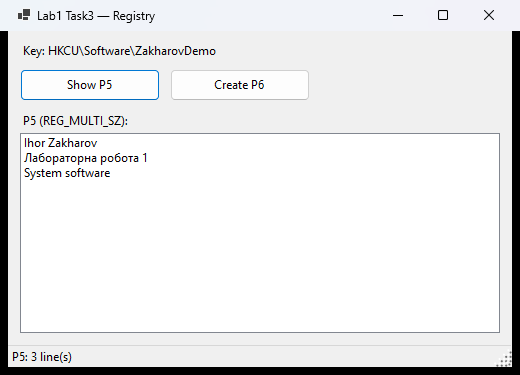
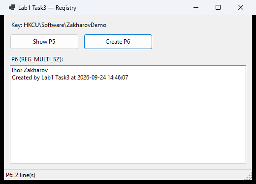

# Task3 — Windows registry: read P5, create P6

Key `HKLM\SOFTWARE\Zakharov` with the value `P5` of type **MultiString** (`REG_MULTI_SZ`) and a Windows Forms program
with two buttons:

- **Show P5** — shows every line of `P5`;
- **Create P6** — creates `P6` (`REG_MULTI_SZ`) with two lines and shows what was actually stored.

| Show P5 | Create P6 |
|---|---|
|  |  |

(The screenshots use a demo key under HKCU — see *Trying it without administrator rights* below.)

## 1. Create the key and P5

Double-click [`registry/create-p5.reg`](registry/create-p5.reg) and confirm (UAC), or in an administrator console:

```
reg import Lab1\Task3\registry\create-p5.reg
```

`P5` gets three lines: `Ihor Zakharov`, `Лабораторна робота 1`, `System software`. The value is written as `hex(7)` —
the raw UTF-16LE bytes of `REG_MULTI_SZ` — so the Cyrillic line survives regardless of the `.reg` file's encoding.
[`registry/delete-zakharov.reg`](registry/delete-zakharov.reg) removes the whole key again.

## 2. Run the program

Start `Task3.RegistryViewer`. Reading `HKLM` works for a normal user; **writing needs administrator rights**. If
*Create P6* is pressed without them, the program offers to restart itself as administrator (UAC), then press
*Create P6* again.

### Trying it without administrator rights

```
Task3.RegistryViewer --key HKCU\Software\ZakharovDemo
```

points the program to a key under `HKCU`, where a normal user may write.

## Design notes

- **64-bit view.** The key is opened with `RegistryKey.OpenBaseKey(..., RegistryView.Registry64)`. A 32-bit process
  would otherwise be redirected to `HKLM\SOFTWARE\WOW6432Node\Zakharov` and not see the key created by 64-bit regedit.
- **Least privilege.** Reading opens the key read-only, so *Show P5* never needs elevation; only *Create P6* opens it
  for writing (`CreateSubKey`, which also creates the key if it is missing).
- **Type check.** If `P5` exists but is not `REG_MULTI_SZ`, the program says which type it found instead of failing.
- **REG_MULTI_SZ format.** Stored as `line1\0line2\0\0` — an empty line would end the list early and hide the lines
  after it, so writing empty lines is rejected.
- **Environment variables** such as `%PATH%` in a line are shown as stored (`DoNotExpandEnvironmentNames`).

## Tests

```
dotnet test ../Lab1.slnx
```

Tests work on a temporary key under `HKCU` (no administrator rights needed) and delete it afterwards. One test imports
the real `create-p5.reg` with `reg.exe` (redirected to the temporary key) and checks all three lines, including the
Cyrillic one, so the `.reg` file itself is verified.
