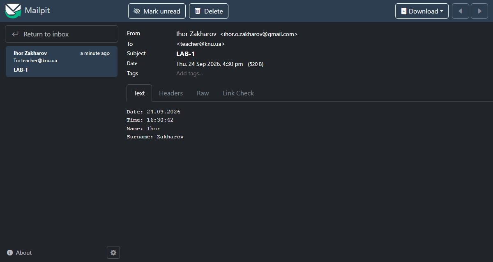

# Task4 — send an email from the command line

Console program that sends an email whose text contains the current **date, time, first name and last name**. Two
arguments are required — the recipient address and the subject (the assignment uses `LAB-1`); without them the program
prints help.



## Usage

```
Task4.Mailer [options] [--] <to> <subject>

  --dry-run     print the message instead of sending it (no SMTP settings needed)
  --trace       print the SMTP conversation to stderr (passwords are redacted)
  -h, --help    show this help
```

SMTP settings come **only from environment variables**, never from the command line or the code, so no password ends
up in the repository, in shell history or in a process list:

| Variable | Meaning | Default |
|---|---|---|
| `LAB1_SMTP_HOST` | server (`smtp.gmail.com`, or `localhost` for Mailpit) | — (required) |
| `LAB1_SMTP_PORT` | port | 587 (465 for `ssl`) |
| `LAB1_SMTP_SECURITY` | `auto` / `starttls` / `ssl` / `none` | `auto` |
| `LAB1_SMTP_USER`, `LAB1_SMTP_PASSWORD` | login (both or neither) | no login |
| `LAB1_SMTP_FROM` | sender address | `LAB1_SMTP_USER` |

Exit codes: `0` — sent, `1` — sending failed (login, TLS, connection, refused), `2` — invalid arguments or settings.

## Try it locally with Mailpit (nothing leaves the PC)

[Mailpit](https://mailpit.axllent.org/) is an SMTP server in Docker that catches every message and shows it in a web UI.

```bash
# WSL
docker compose -f /mnt/c/Users/Ihor/projects/syssoft-labs/Lab1/Task4/compose.yaml up -d
```

```powershell
# PowerShell
$env:LAB1_SMTP_HOST = "localhost"; $env:LAB1_SMTP_PORT = "1025"; $env:LAB1_SMTP_SECURITY = "none"
$env:LAB1_SMTP_FROM = "ihor.o.zakharov@gmail.com"
dotnet run --project Lab1\Task4\Task4.Mailer -- teacher@knu.ua LAB-1 --trace
```

Open <http://localhost:8025> to see the message.

## Send for real through Gmail

1. Google account → Security → turn on **2-Step Verification**.
2. Create an **app password** at <https://myaccount.google.com/apppasswords> (Gmail rejects the normal password for
   SMTP). Personal Gmail works; university Google Workspace accounts may have app passwords disabled.
3. Run the script — it asks for the address and the app password with hidden input and removes them afterwards:

```powershell
powershell -ExecutionPolicy Bypass -File Lab1\Task4\send-gmail.ps1 -To teacher@knu.ua -Trace
```

## How it works — the SMTP conversation

`--trace` shows the real dialogue (here with Mailpit; Gmail adds `STARTTLS` and `AUTH` after the first `EHLO`):

```
S: 220 Mailpit ESMTP Service ready
C: EHLO DESKTOP-HMVVBQ5                         introduce ourselves, ask what the server supports
S: 250-SIZE 52428800 / 8BITMIME / SMTPUTF8 ...
C: MAIL FROM:<ihor.o.zakharov@gmail.com>        envelope sender (used for delivery and bounces)
C: RCPT TO:<teacher@knu.ua>                     envelope recipient
C: DATA
S: 354 Start mail input; end with <CR><LF>.<CR><LF>
C: From: Ihor Zakharov <ihor.o.zakharov@gmail.com>   headers the reader sees
C: Subject: LAB-1
C: Content-Type: text/plain; charset=utf-8
C:
C: Date: 24.09.2026
C: Time: 16:30:42
C: Name: Ihor
C: Surname: Zakharov
C: .                                            a line with a single dot ends the message
S: 250 2.0.0 Ok: queued as 6j3oBGwZKeGmYyQ6OcFfX3
C: QUIT
```

## Design notes

- **MailKit instead of `System.Net.Mail.SmtpClient`** — Microsoft marks `SmtpClient` as not recommended for new
  development (no implicit TLS on 465, outdated protocol support) and points to MailKit.
- **Security modes**: `starttls` = plain connection upgraded with `STARTTLS` (port 587), `ssl` = TLS from the first
  byte (port 465), `none` = local test servers only. With `--trace` the `AUTH` exchange is redacted.
- **Envelope vs headers**: `MAIL FROM`/`RCPT TO` are what servers use to deliver; `From:`/`To:` are what the reader
  sees. They may differ — which is why SPF/DKIM/DMARC exist.
- **Line endings**: email lines end with CRLF (RFC 5322). The body is built with explicit `\r\n` so it does not depend
  on the line endings of the source file (LF or CRLF after a git checkout).
- **Addresses** are validated with MimeKit: one plain address with a dotted domain, no display names or lists.

## Tests

```
dotnet test ../Lab1.slnx
```

Unit tests cover argument parsing, settings from the environment (without ever printing the password), the message
itself (headers, CRLF body, a Cyrillic subject surviving MIME encoding). Two integration tests send real messages to
Mailpit and check them through its REST API — subject, recipient, sender name, body, and the SMTP conversation in the
trace. Without Mailpit running they are skipped.
